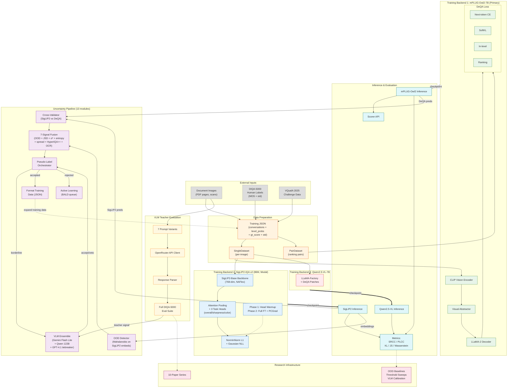

# DeQA-Doc Architecture

> Last updated: 2026-03-12

## System Overview



## Source File Traceability

### Data Preparation

| Component | Source Files |
|-----------|-------------|
| SingleDataset | `DeQA-Score/src/datasets/single_dataset.py` |
| PairDataset | `DeQA-Score/src/datasets/pair_dataset.py` |
| Data utilities | `DeQA-Score/src/datasets/utils.py` |
| Training data | `Data-DeQA-Score/DIQA/metas/`, `Data-DeQA-Score/KONIQ/metas/` |

### mPLUG-Owl2 Training (Primary)

| Component | Source Files |
|-----------|-------------|
| Training loop | `DeQA-Score/src/train/train_mem.py` |
| DeQA Loss | `DeQA-Score/src/train/loss.py` |
| Custom trainer | `DeQA-Score/src/train/mplug_owl2_trainer.py` |
| Model architecture | `DeQA-Score/src/model/modeling_mplug_owl2.py` |
| Model builder | `DeQA-Score/src/model/builder.py` |
| find_prefix() | `DeQA-Score/src/model/utils.py` |
| Training scripts | `DeQA-Score/scripts/train.sh`, `scripts/train_lora.sh` |

### SigLIP2-IQA v2 (Modal Cloud)

| Component | Source Files |
|-----------|-------------|
| Model architecture | `modal/siglip2_v2_model.py` |
| Training orchestration | `modal/train_siglip2_iqa_v2.py` |
| Data loading | `modal/siglip2_v2_data.py` |
| PCGrad optimizer | `modal/pcgrad.py` |
| Configs | `modal/configs/siglip2_v2_*.yaml` |

### Qwen2.5-VL (LLaMA-Factory Patches)

| Component | Source Files |
|-----------|-------------|
| DeQA loss adaptation | `Llamafactory/src/llamafactory/train/sft/loss.py` |
| Custom trainer | `Llamafactory/src/llamafactory/train/sft/trainer.py` |
| Data collator | `Llamafactory/src/llamafactory/data/collator.py` |
| Training args | `Llamafactory/src/llamafactory/hyparams/finetuning_args.py` |

### Inference & Evaluation

| Component | Source Files |
|-----------|-------------|
| mPLUG-Owl2 inference | `DeQA-Score/src/evaluate/iqa_eval.py` |
| Qwen2.5-VL inference | `DeQA-Score/src/evaluate/iqa_eval_qwen.py` |
| Scorer API | `DeQA-Score/src/evaluate/scorer.py` |
| SRCC/PLCC | `DeQA-Score/src/evaluate/cal_plcc_srcc.py` |
| Distribution metrics | `DeQA-Score/src/evaluate/cal_distribution_gap.py` |

### Uncertainty Pipeline (13 modules)

| Component | Source Files |
|-----------|-------------|
| Orchestrator | `DeQA-Score/src/uncertainty/pseudo_label.py` |
| OOD detector | `DeQA-Score/src/uncertainty/ood_wrapper.py` |
| Cross-validator | `DeQA-Score/src/uncertainty/cross_validator.py` |
| 7-signal fusion | `DeQA-Score/src/uncertainty/fusion.py` |
| VLM ensemble validator | `DeQA-Score/src/uncertainty/vlm_validator.py` |
| Gaussian→discrete | `DeQA-Score/src/uncertainty/gaussian_to_discrete.py` |
| Discrete metrics | `DeQA-Score/src/uncertainty/discrete_metrics.py` |
| Active learning | `DeQA-Score/src/uncertainty/active_learning.py` |
| Format output | `DeQA-Score/src/uncertainty/format_training_data.py` |
| Metadata schema | `DeQA-Score/src/uncertainty/metadata_schema.py` |
| Metadata I/O | `DeQA-Score/src/uncertainty/metadata_io.py` |
| Validation | `DeQA-Score/src/uncertainty/validation.py` |
| Metadata convert | `DeQA-Score/src/uncertainty/metadata_convert.py` |

### VLM Teacher Evaluation

| Component | Source Files |
|-----------|-------------|
| Evaluation runner | `results/vlm_teacher_eval/run_eval.py` |
| API client | `results/vlm_teacher_eval/vlm_client.py` |
| Prompt templates | `results/vlm_teacher_eval/prompts.py` |
| Response parser | `results/vlm_teacher_eval/response_parser.py` |
| Full eval suite | `results/vlm_teacher_eval/full_eval/run_full_diqa_eval.py` |

### Research

| Component | Source Files |
|-----------|-------------|
| Paper generation | `research/papers/generate_all.py` |
| OOD baselines | `research/ood_baselines/` |
| VLM calibration | `research/vlm_calibration/` |
| Threshold sensitivity | `research/threshold_sensitivity/` |

## Key Domain Constants

```
Quality Levels:  [excellent, good, fair, poor, bad]
Level Indices:   [0, 1, 2, 3, 4]
Level Scores:    [5, 4, 3, 2, 1]
MOS Formula:     dot(level_probs, [5, 4, 3, 2, 1])
Level Prefix:    "The quality of the image is"

OOD Thresholds (recalibrated 2026-03-10):
  soft_reject:   55.37 (GT TPR@95%, FPR=14.6%)
  hard_reject:   61.62 (GT TPR@80%)
```
