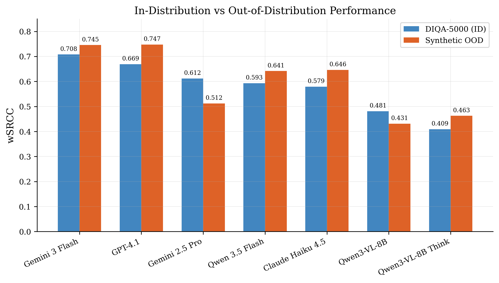
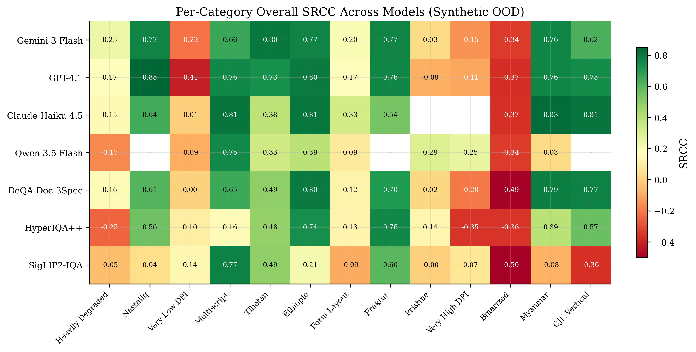
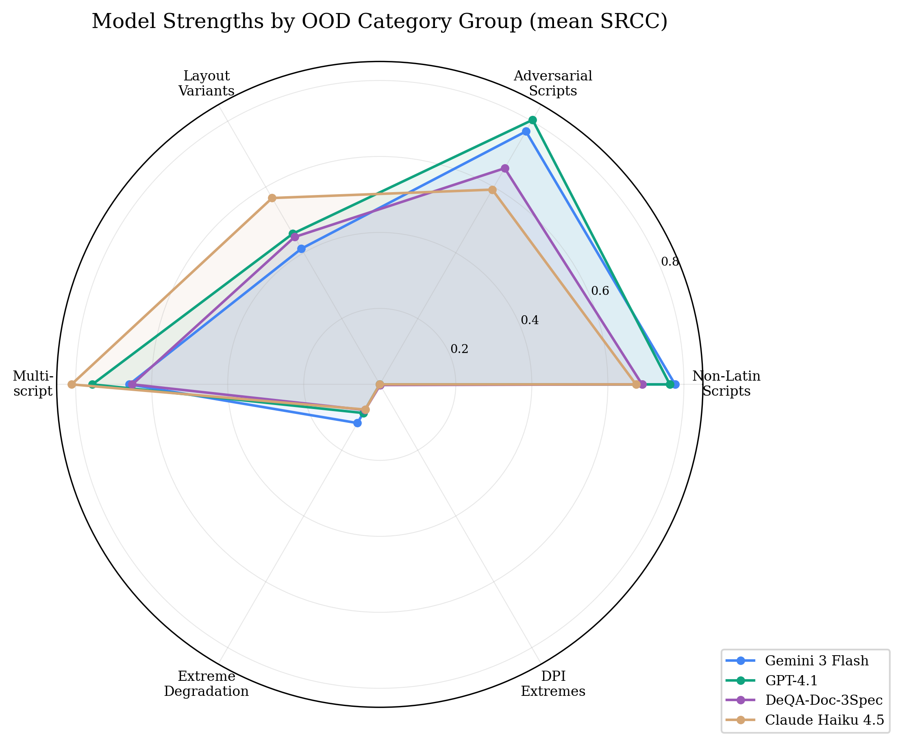
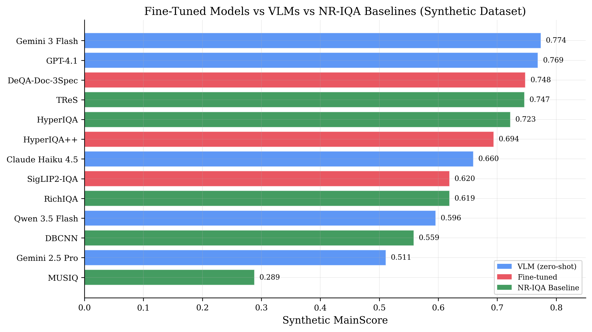

# Cross-Domain Generalization of VLM Quality Assessors

**Author:** Byron Williams
**Date:** March 2026
**Series:** DeQA-Doc Technical Report 2/10
**Repository:** `results/vlm_teacher_eval/`
**License:** CC BY-SA 4.0, Copyright 2025 Byron Williams
**Keywords:** cross-domain generalization, VLM, document quality, out-of-distribution, synthetic data

---

> **Update (2026-03-09):** This paper was originally written around 7 VLMs (batch 1). A batch 2 evaluation added 14 more VLMs (21 total). Key tables and data sections have been updated. The original analysis and findings are confirmed by the expanded benchmark. See [LEADERBOARD_SYNTHETIC.md](../../../results/LEADERBOARD_SYNTHETIC.md) for the full 29-model ranking.

## Abstract

Vision-language models (VLMs) achieve strong correlation with human quality judgments on in-distribution document images, but their reliability on out-of-distribution (OOD) document types -- the very categories where VLM pseudo-labels are most needed -- remains underexplored. We evaluate 21 VLMs and 3 fine-tuned IQA models across 13 OOD document categories spanning non-Latin scripts, adversarial typefaces, extreme DPI, binarization, and unusual layouts, using a 520-image synthetic benchmark with controlled quality parameters. Our results reveal three key findings. First, the top VLMs (Gemini 3 Flash, GPT-4.1) maintain or slightly improve their aggregate wSRCC on OOD data compared to in-distribution DIQA-5000 performance (0.745 vs 0.708 and 0.747 vs 0.669, respectively), while fine-tuned specialist models degrade (HyperIQA++: 0.549 OOD vs 0.754 ID). Second, performance varies dramatically by category: non-Latin scripts (SRCC 0.73--0.85) and adversarial typefaces (SRCC 0.54--0.85) are well-handled, while binarized documents (SRCC -0.34 to -0.49), extreme DPI (SRCC -0.41 to +0.25), and pristine documents (SRCC -0.20 to +0.30) defeat all models. Third, GPT-4.1 and Gemini 3 Flash exhibit complementary strengths -- GPT-4.1 leads on adversarial scripts and CJK vertical layouts, while Gemini 3 Flash leads on non-Latin scripts and in-distribution -- motivating a multi-model consensus approach for pseudo-labeling. These findings directly inform the design of our VLM pseudo-labeling pipeline (Paper 7), identifying which OOD categories can be pseudo-labeled with confidence and which require human annotation or future VLM improvements.

---

## 1. Introduction

Paper 1 in this series established that frontier VLMs can approximate human quality judgments on document images, with Gemini 3 Flash Preview achieving wSRCC = 0.708 on the DIQA-5000 test set (n = 1,000) -- approaching the supervised DeQA-Doc-3Specialists baseline (wSRCC = 0.716). However, the primary use case for VLM pseudo-labeling is not in-distribution documents, where fine-tuned models already excel, but out-of-distribution document types where specialist models degrade.

The SigLIP2-IQA student model achieves MainScore = 0.886 on DIQA-5000 but drops to 0.620 on synthetic OOD data -- a 30% decline that leaves entire document categories (non-Latin scripts, unusual layouts, extreme degradation) without reliable quality assessment. Expanding SigLIP2's domain coverage requires new training data with quality annotations, but the DIQA-5000 annotation protocol (15 human raters per image across 3 dimensions) is prohibitively expensive to repeat for every new document type.

This paper investigates whether VLMs can serve as reliable quality annotators for OOD documents. We evaluate cross-domain generalization using a 520-image synthetic benchmark spanning 13 OOD categories, comparing VLMs against fine-tuned specialists and off-the-shelf NR-IQA baselines. The central question is practical: for which document types can we trust VLM pseudo-labels, and where must we fall back to human annotation?

### 1.1 Research Questions

1. How does VLM quality assessment performance change from in-distribution to out-of-distribution documents?
2. Which OOD categories are well-served by VLM pseudo-labels, and which represent failure modes?
3. Do different VLMs have complementary strengths across OOD categories?
4. How do fine-tuned specialist models compare to VLMs on OOD data, and does fine-tuning help or hurt generalization?

### 1.2 Contributions

- A systematic evaluation of 21 VLMs, 3 fine-tuned IQA models, and 5 NR-IQA baselines across 13 OOD document categories
- Identification of universal failure modes (binarized, extreme DPI, pristine) where no current model produces reliable quality estimates
- Evidence of complementary model strengths motivating multi-model consensus for pseudo-labeling
- Quantification of the specialization-generalization tradeoff: fine-tuning improves ID performance at the cost of OOD robustness

---

## 2. Task Definition & Related Work

### 2.1 Document Image Quality Assessment

Document IQA predicts how well a scanned or photographed document can be read by humans, scoring three dimensions: overall quality (holistic readability), sharpness (text edge clarity and resolution adequacy), and color fidelity (color accuracy, contrast, and tonal reproduction). Scores follow the DIQA-5000 protocol: 1.0 (bad) to 5.0 (excellent), with the VQualA competition metric wSRCC = 0.5 * SRCC_overall + 0.25 * SRCC_sharpness + 0.25 * SRCC_color.

Document IQA differs from natural image IQA in fundamental ways. Natural IQA models are trained on photographs with distortions like compression artifacts and Gaussian blur. Document images present text legibility, layout coherence, scanning artifacts (moire, shadows, creases), and script-specific quality dimensions that natural IQA models have no representation for.

### 2.2 Cross-Domain Generalization in IQA

Cross-domain generalization in IQA has been studied primarily for natural images. Models trained on one distortion corpus (e.g., LIVE) often degrade on others (TID2013, CSIQ). The document domain introduces additional axes of variation: script system, layout convention, rendering technology, and digitization method.

Prior work on VLM-based IQA (Q-Instruct, Q-Bench) has focused on natural image quality. Our work extends this to the document domain, where the OOD challenge is more severe because document types are discrete (Latin vs. Tibetan script) rather than continuous (more vs. less JPEG compression).

### 2.3 The Pseudo-Labeling Context

This evaluation is not an academic exercise in cross-domain benchmarking. It serves a specific engineering purpose: determining which OOD document categories can receive reliable VLM pseudo-labels for expanding SigLIP2-IQA's training set. The quality bar is SRCC > 0.6 per dimension -- below this, pseudo-labels introduce more noise than signal. Categories that fail this bar must wait for human annotation or future model improvements.

---

## 3. Experimental Setup

### 3.1 Datasets

**Primary evaluation: DIQA-5000 test set (n = 1,000).** Real document images with human MOS ground truth from 15 annotators per image across 3 quality dimensions. This serves as the in-distribution (ID) reference.

**Cross-domain evaluation: Synthetic OOD benchmark (n = 520).** Generated programmatically with controlled degradation parameters, providing ground truth MOS derived from generation parameters (degradation level, noise intensity, resolution). The dataset comprises:

| Subset | n | Description |
|--------|---|-------------|
| ID: Standard | 100 | Latin-script documents matching DIQA-5000 characteristics |
| ID: Cyrillic | 50 | Cyrillic-script documents with DIQA-like degradation |
| OOD: Non-Latin scripts | 90 | Tibetan (30), Myanmar (30), Ethiopic (30) |
| OOD: Adversarial scripts | 40 | Fraktur (20), Nastaliq (20) |
| OOD: Layout variants | 60 | CJK vertical (30), form layouts (30) |
| OOD: Extreme degradation | 60 | Binarized (30), heavily degraded (30) |
| OOD: Multiscript | 30 | Mixed-script documents |
| OOD: DPI extremes | 60 | Very low DPI (30), very high DPI (30) |
| OOD: Pristine | 30 | Near-perfect digital documents |

The 13 OOD categories were selected to stress-test specific failure modes: script unfamiliarity, extreme processing, quality ceiling effects, and layout diversity.

### 3.2 Models

We evaluate three model families:

**VLM teachers (21 models, zero-shot).** All accessed via OpenRouter API with temperature = 0.0 (except thinking models, which use provider defaults). Images resized to fit 1024x1024 pixels (preserving aspect ratio). Each model receives a structured prompt requesting JSON ratings on a 1.0--5.0 scale with 0.1 granularity. The initial batch of 7 models was selected via a 26-model smoke test; 14 additional models were added in batch 2 to broaden provider and architecture coverage.

| Model | Provider | Params |
|-------|----------|--------|
| Gemini 3 Flash Preview | Google | N/A (API) |
| GPT-4.1 | OpenAI | N/A (API) |
| Gemini 2.5 Pro | Google | N/A (API) |
| Qwen 3.5 Flash | Alibaba | N/A (API) |
| Claude Haiku 4.5 | Anthropic | N/A (API) |
| Qwen3-VL-8B Instruct | Alibaba | 8B |
| Qwen3-VL-8B Thinking | Alibaba | 8B |
| Qwen 3.5 Plus | Alibaba | N/A (API) |
| Qwen 3.5 122B-A10B | Alibaba | 122B MoE |
| Qwen3-VL-235B Instruct | Alibaba | 235B |
| Gemini 3.1 Flash Lite | Google | N/A (API) |
| Seed 1.6 | ByteDance | N/A (API) |
| Grok 4.1 Fast | xAI | N/A (API) |
| Seed 1.6 Flash | ByteDance | N/A (API) |
| Nemotron Nano 12B VL | NVIDIA | 12B |
| Qwen3-VL-30B Thinking | Alibaba | 30B MoE |
| Qwen3-VL-235B Thinking | Alibaba | 235B |
| Mistral Small 3.1 24B | Mistral | 24B |
| Gemma 3 4B | Google | 4B |
| Gemma 3 12B | Google | 12B |
| Gemma 3 27B | Google | 27B |

**Fine-tuned IQA models (3 models).** Trained on DIQA-5000 (3,500 training images):

| Model | Architecture | Training |
|-------|-------------|----------|
| DeQA-Doc-3Specialists | mPLUG-Owl2 (7B) x 3 | Full SFT, DeQA soft-label loss |
| HyperIQA++ | ResNet-50 + HyperNet (138M) | Full FT, 10-bin soft labels |
| SigLIP2-IQA-Base-86M | SigLIP2 ViT-B/16 (88M) | Two-phase: warmup + full FT |

**NR-IQA baselines (5 models).** Off-the-shelf pretrained on KonIQ-10K (natural images), evaluated via pyiqa library: TReS, HyperIQA, RichIQA (TOPIQ-NR), DBCNN, MUSIQ.

### 3.3 Evaluation Protocol

**Metrics.** We report SRCC (Spearman rank correlation), PLCC (Pearson linear correlation with 4-parameter logistic fitting), MAE, and the composite wSRCC and MainScore (= 0.5 * Score_overall + 0.25 * Score_sharpness + 0.25 * Score_color, where Score_dim = 0.5 * (PLCC + SRCC)).

**Subsets.** We partition synthetic results into ID (n = 150: standard + Cyrillic) and OOD (n = 370: all 13 OOD categories) to measure the generalization gap.

**Per-category analysis.** We compute overall SRCC for each of the 13 OOD categories independently. Small category sizes (n = 20--30) limit statistical power for individual categories, but the pattern across all 13 categories provides robust signal.

**Parse failures.** Gemini 2.5 Pro had 95 parse failures (18.3%) from non-JSON output. Qwen 3.5 Flash had 69 failures (13.3%). Qwen3-VL-8B Thinking had 2 failures (0.4%). Metrics for affected models are computed on valid responses only.

---

## 4. Results

### 4.1 In-Distribution vs Out-of-Distribution Performance

Table 1 compares each model's performance on DIQA-5000 (ID) against the synthetic OOD dataset. The generalization gap reveals a fundamental divide between model families.

**Table 1: ID vs OOD Performance (wSRCC) — All 21 VLMs + Fine-tuned Models**

| Model | Type | ID (DIQA-5000) | OOD (Synthetic) | Delta |
|-------|------|----------------|-----------------|-------|
| GPT-4.1 | VLM | 0.669 | 0.757 | +0.089 |
| Gemini 3 Flash | VLM | 0.708 | 0.738 | +0.030 |
| Claude Haiku 4.5 | VLM | 0.579 | 0.591 | +0.012 |
| Gemma 3 12B | VLM | 0.242 | 0.402 | +0.160 |
| Grok 4.1 Fast | VLM | 0.095 | 0.149 | +0.054 |
| Qwen3-VL-8B Think | VLM | 0.409 | 0.428 | +0.019 |
| Gemma 3 4B | VLM | 0.251 | 0.268 | +0.017 |
| Gemma 3 27B | VLM | 0.396 | 0.382 | -0.014 |
| Nemotron Nano 12B VL | VLM | 0.187 | 0.183 | -0.004 |
| Seed 1.6 Flash | VLM | 0.483 | 0.437 | -0.046 |
| Qwen 3.5 Flash | VLM | 0.593 | 0.542 | -0.051 |
| Mistral Small 3.1 24B | VLM | 0.488 | 0.421 | -0.067 |
| Qwen3-VL-8B Instruct | VLM | 0.481 | 0.388 | -0.092 |
| Qwen 3.5 122B-A10B | VLM | 0.713 | 0.609 | -0.104 |
| Gemini 3.1 Flash Lite | VLM | 0.694 | 0.581 | -0.113 |
| Qwen 3.5 Plus | VLM | 0.679 | 0.559 | -0.119 |
| Gemini 2.5 Pro | VLM | 0.612 | 0.466 | -0.146 |
| Qwen3-VL-30B Think | VLM | 0.537 | 0.336 | -0.201 |
| Seed 1.6 | VLM | 0.557 | 0.251 | -0.306 |
| Qwen3-VL-235B Instruct | VLM | 0.577 | 0.229 | -0.348 |
| Qwen3-VL-235B Think | VLM | 0.534 | 0.184 | -0.350 |
| DeQA-Doc-3Spec | Fine-tuned | 0.716 | 0.715 | -0.001 |
| HyperIQA++ | Fine-tuned | 0.754* | 0.549 | -0.205 |
| SigLIP2-IQA | Fine-tuned | 0.634* | 0.559 | -0.075 |

*ID values for fine-tuned models use synthetic ID subset wSRCC rather than DIQA-5000 wSRCC for direct comparability.

*Figure 1: VLM wSRCC on DIQA-5000 (in-distribution) vs synthetic OOD data. With 21 VLMs, 7 show improved OOD performance vs ID. GPT-4.1 shows the largest gain (+0.089). Several batch 2 models (Qwen 3.5 122B-A10B, Gemini 3.1 Flash Lite, Qwen 3.5 Plus) show significant OOD degradation (-0.10 to -0.12) despite strong ID performance.*

**Key findings:**

1. **VLM generalization is model-dependent, not universal.** With the expanded 21-model benchmark, 7 of 21 VLMs improve on OOD data, while 14 degrade. The top generalizers are GPT-4.1 (+0.089), Gemma 3 12B (+0.160), and Gemini 3 Flash (+0.030). Strong ID performance does not predict strong OOD performance: Qwen 3.5 122B-A10B ranks #2 on DIQA (wSRCC = 0.713) but drops -0.104 on OOD data.

2. **Large Qwen models degrade severely on OOD.** Qwen3-VL-235B Instruct (-0.348) and Qwen3-VL-235B Thinking (-0.350) show the largest OOD degradation of any VLMs, despite moderate DIQA performance. Seed 1.6 (-0.306) also collapses on synthetic data. This suggests these models may have DIQA-like data in their training distribution.

3. **Fine-tuning creates a specialization-generalization tradeoff.** HyperIQA++ shows large degradation (delta = -0.205): its standard regression training overfits to DIQA-5000 characteristics. DeQA-Doc-3Specialists is the exception, maintaining near-identical OOD performance (delta = -0.001), likely because the mPLUG-Owl2 MLLM backbone retains general visual understanding even after fine-tuning, and the soft-label distribution learning objective produces inherently more generalizable representations.

4. **SigLIP2-IQA confirms the need for domain expansion.** Its OOD wSRCC of 0.559 represents the gap that VLM pseudo-labeling must close.

### 4.2 Per-Category OOD Analysis

Performance varies dramatically across the 13 OOD categories. Table 2 shows overall SRCC by category for all models evaluated.

**Table 2: Per-Category Overall SRCC (All Models)**

| Category | n | Gemini 3 Flash | GPT-4.1 | Haiku 4.5 | DeQA-3Spec | HyperIQA++ | SigLIP2 |
|----------|---|---------------|---------|-----------|------------|------------|---------|
| Multiscript | 30 | 0.659 | **0.756** | 0.811 | 0.651 | 0.159 | **0.772** |
| Ethiopic | 30 | 0.767 | **0.797** | 0.806 | 0.796 | 0.736 | 0.212 |
| Myanmar | 30 | 0.763 | 0.763 | **0.833** | 0.786 | 0.390 | -0.079 |
| Tibetan | 30 | **0.800** | 0.729 | 0.383 | 0.488 | 0.479 | 0.491 |
| CJK Vertical | 30 | 0.624 | **0.747** | 0.808 | 0.772 | 0.568 | -0.363 |
| Nastaliq | 20 | 0.770 | **0.846** | 0.642 | 0.609 | 0.558 | 0.040 |
| Fraktur | 20 | **0.768** | 0.762 | 0.542 | 0.705 | 0.759 | 0.598 |
| Form Layout | 30 | 0.201 | 0.169 | 0.325 | 0.124 | 0.131 | -0.094 |
| Heavily Degraded | 30 | 0.235 | 0.174 | 0.153 | 0.156 | -0.249 | -0.048 |
| Binarized | 30 | -0.340 | -0.372 | -0.367 | **-0.490** | -0.356 | **-0.499** |
| Pristine | 30 | 0.032 | -0.086 | -- | 0.022 | 0.135 | -0.004 |
| Very High DPI | 30 | -0.150 | -0.109 | -- | -0.200 | -0.354 | 0.074 |
| Very Low DPI | 30 | -0.216 | -0.411 | -0.005 | 0.004 | 0.105 | 0.141 |

Note: "--" indicates null SRCC (insufficient variance in predictions).

*Figure 2: Overall SRCC by model and OOD category. Green indicates strong positive correlation; red indicates negative or near-zero correlation. All models fail on binarized, extreme DPI, and pristine categories.*

The categories fall into three tiers:

**Tier A -- Reliable (SRCC > 0.5 for top models).** Non-Latin scripts (Tibetan, Myanmar, Ethiopic), adversarial typefaces (Fraktur, Nastaliq), CJK vertical layouts, and multiscript documents. These categories can receive VLM pseudo-labels with confidence. The best SRCC values reach 0.846 (GPT-4.1 on Nastaliq) and 0.833 (Claude Haiku on Myanmar).

**Tier B -- Marginal (SRCC 0.1--0.5).** Form layouts and heavily degraded documents. Models detect gross quality differences but cannot discriminate fine-grained quality levels. Pseudo-labels from these categories should be treated with elevated uncertainty weights.

**Tier C -- Failure (SRCC < 0.1 or negative).** Binarized documents, pristine documents, and extreme DPI (both very low and very high). These represent fundamental blind spots:

- **Binarized:** All models produce negative SRCC (-0.34 to -0.49). Binary thresholding removes the gradual quality variation that models rely on. The quality of a binarized document depends on threshold selection and content preservation -- attributes that neither VLMs nor traditional IQA models can assess from the result alone.

- **Pristine:** Near-zero SRCC. When documents are near-perfect, quality differences are imperceptible to VLMs. The ground truth variation comes from subtle rendering differences (anti-aliasing, sub-pixel hinting) that are below VLM resolution.

- **Extreme DPI:** Negative SRCC at both extremes. Very low DPI images lack the detail for quality assessment; very high DPI images may trigger resolution-related biases where models assume higher resolution equals higher quality, inverting the actual quality ranking.

### 4.3 Model-Specific Strengths and Weaknesses

*Figure 3: Mean SRCC by OOD category group for the top 4 models. GPT-4.1 leads on adversarial scripts and multiscript; Gemini 3 Flash leads on non-Latin scripts; Claude Haiku 4.5 shows surprising strength on layout variants. All models collapse on extreme degradation and DPI extremes.*

**Gemini 3 Flash Preview** achieves the highest aggregate OOD MainScore (0.782) and leads on non-Latin scripts (Tibetan: 0.800, Ethiopic: 0.767) and in-distribution categories. Its strength in script-agnostic quality assessment likely reflects broad multilingual training data. Weaknesses include CJK vertical (0.624, behind GPT-4.1's 0.747) and form layouts (0.201).

**GPT-4.1** achieves the highest OOD wSRCC (0.747) and dominates adversarial scripts (Nastaliq: 0.846, Fraktur: 0.762), CJK vertical (0.747), and multiscript (0.756). Its systematic positive bias (MAE = 1.15 on DIQA-5000) does not harm ranking accuracy. However, it is the worst VLM on very low DPI (-0.411), suggesting over-reliance on resolution cues.

**Claude Haiku 4.5** shows an unexpected pattern: its OOD wSRCC (0.646) exceeds its DIQA-5000 wSRCC (0.579) by a larger margin than any other model (+0.067). It leads on Myanmar (0.833), CJK vertical (0.808), and multiscript (0.811). Its conservative rating behavior (lowest MAE = 0.68 on DIQA-5000) may help on OOD data by avoiding the over-rating that penalizes other models when ground truth quality is lower.

**DeQA-Doc-3Specialists** is the best-generalizing fine-tuned model. Its OOD wSRCC (0.715) nearly matches its ID wSRCC (0.762), a delta of only -0.047. The soft-label distribution learning objective and MLLM backbone jointly explain this robustness: the model learned quality as a distribution over discrete levels rather than a point estimate, and the mPLUG-Owl2 backbone retains visual understanding from pre-training.

**HyperIQA++** exemplifies the specialization trap. Despite strong ID performance (wSRCC = 0.754), it degrades sharply on OOD data (0.549, delta = -0.205). Standard regression training on DIQA-5000 causes the ResNet-50 backbone to overfit to DIQA-specific quality patterns. Its negative SRCC on heavily degraded (-0.249) and very high DPI (-0.354) categories indicates complete quality signal inversion.

**Qwen models** (8B Instruct and Thinking) and **Qwen 3.5 Flash** perform consistently below the top tier across all OOD categories. Notably, Qwen 3.5 Flash had category-level missing data (no scores for Nastaliq, Fraktur, CJK vertical, very low DPI) due to parse failures concentrated in specific categories. The 8B models' ceiling appears to be around wSRCC = 0.46 on OOD data, insufficient for pseudo-labeling.

**Gemini 2.5 Pro** despite being the most capable general-purpose model in the Gemini family, degrades severely on synthetic data (wSRCC = 0.468, MainScore = 0.511) with 18.3% parse failures. Its OOD performance (0.512 wSRCC) is worse than every fine-tuned model except SigLIP2-IQA. Extended reasoning may introduce overthinking that hurts quality assessment, a pattern also observed in Qwen3-VL-8B Thinking versus Instruct.

### 4.4 Fine-Tuned Models vs VLMs on Synthetic Data

Table 3 presents the full comparison across all model families on the synthetic dataset using unified MainScore.

**Table 3: All Models on Synthetic Dataset (MainScore)**

| Model | Type | MainScore (All) | SRCC_O | SRCC_S | SRCC_C |
|-------|------|----------------|--------|--------|--------|
| **Gemini 3 Flash** | VLM | **0.768** | 0.753 | 0.775 | 0.668 |
| GPT-4.1 | VLM | 0.768 | **0.764** | **0.797** | **0.704** |
| DeQA-Doc-3Spec | Fine-tuned | 0.748 | 0.696 | 0.778 | 0.687 |
| TReS | NR-IQA | 0.747 | 0.683 | 0.723 | 0.706 |
| HyperIQA (baseline) | NR-IQA | 0.723 | 0.639 | 0.643 | 0.639 |
| HyperIQA++ | Fine-tuned | 0.694 | 0.589 | 0.623 | 0.606 |
| Claude Haiku 4.5 | VLM | 0.646 | 0.582 | 0.630 | 0.570 |
| Gemini 3.1 Flash Lite | VLM | 0.642 | 0.576 | 0.607 | 0.567 |
| Qwen 3.5 122B-A10B | VLM | 0.625 | 0.614 | 0.631 | 0.545 |
| SigLIP2-IQA | Fine-tuned | 0.620 | 0.495 | 0.577 | 0.507 |
| RichIQA | NR-IQA | 0.619 | 0.482 | 0.507 | 0.499 |
| Qwen 3.5 Plus | VLM | 0.570 | 0.558 | 0.590 | 0.478 |
| Qwen 3.5 Flash | VLM | 0.567 | 0.550 | 0.603 | 0.583 |
| DBCNN | NR-IQA | 0.559 | 0.560 | 0.594 | 0.556 |
| Seed 1.6 Flash | VLM | 0.489 | 0.449 | 0.485 | 0.399 |
| Gemini 2.5 Pro | VLM | 0.477 | 0.469 | 0.591 | 0.344 |
| Mistral Small 3.1 24B | VLM | 0.476 | 0.453 | 0.427 | 0.395 |
| Gemma 3 12B | VLM | 0.459 | 0.432 | 0.433 | 0.344 |
| Qwen3-VL-8B Think | VLM | 0.450 | 0.430 | 0.485 | 0.373 |
| Qwen3-VL-8B Instruct | VLM | 0.449 | 0.413 | 0.437 | 0.291 |
| Gemma 3 27B | VLM | 0.440 | 0.401 | 0.415 | 0.362 |
| Qwen3-VL-30B Think | VLM | 0.408 | 0.358 | 0.380 | 0.310 |
| Seed 1.6 | VLM | 0.372 | 0.263 | 0.312 | 0.288 |
| Gemma 3 4B | VLM | 0.323 | 0.286 | 0.290 | 0.224 |
| Qwen3-VL-235B Inst. | VLM | 0.294 | 0.234 | 0.249 | 0.186 |
| MUSIQ | NR-IQA | 0.289 | 0.252 | 0.199 | 0.258 |
| Qwen3-VL-235B Think | VLM | 0.232 | 0.189 | 0.183 | 0.147 |
| Nemotron Nano 12B VL | VLM | 0.207 | 0.193 | 0.184 | 0.130 |
| Grok 4.1 Fast | VLM | 0.134 | 0.135 | 0.102 | 0.080 |

*Figure 4: Synthetic MainScore across all model families. The top VLMs (Gemini 3 Flash, GPT-4.1) slightly outperform fine-tuned models, while off-the-shelf NR-IQA baselines (TReS, HyperIQA) score competitively because synthetic degradation patterns align with their natural-image training.*

**Key findings:**

1. **Top VLMs lead on synthetic data.** Gemini 3 Flash and GPT-4.1 (both MainScore = 0.768) outperform every fine-tuned model, including DeQA-Doc-3Specialists (0.748). The advantage is modest (2 points) but consistent across dimensions. However, only 2 of 21 VLMs surpass the fine-tuned baseline — most VLMs score below it.

2. **Off-the-shelf NR-IQA models perform surprisingly well on synthetic data.** TReS achieves MainScore = 0.747 -- nearly matching DeQA-Doc-3Specialists -- despite never seeing a document image during training. This occurs because synthetic degradation (controlled blur, noise, compression) maps naturally to KonIQ-10K quality attributes. In contrast, these same models score 0.185--0.490 on DIQA-5000, confirming that real document quality is a fundamentally different domain.

3. **Fine-tuning can hurt synthetic performance.** HyperIQA++ (fine-tuned, MainScore = 0.694) underperforms baseline HyperIQA (off-the-shelf, 0.723) on synthetic data. Fine-tuning on DIQA-5000 replaced general quality features with document-specific ones that transfer poorly to synthetically degraded documents.

4. **PLCC consistently exceeds SRCC on synthetic data.** The 4-parameter logistic fit improves all models: HyperIQA baseline (PLCC_O = 0.798 vs SRCC_O = 0.639, delta = 0.159), Gemini 3 Flash (0.804 vs 0.753, delta = 0.051), DeQA-Doc (0.765 vs 0.696, delta = 0.069). The prediction-to-MOS relationship is inherently nonlinear, and the logistic fit captures this.

5. **Color fidelity remains the hardest dimension.** Across all models, SRCC_color is the lowest: GPT-4.1 achieves the best at 0.704, while most models fall below 0.60. Color quality assessment in documents depends on subtle factors (paper tone, ink density, background uniformity) that differ from natural image color quality.

### 4.5 Error Analysis & Failure Cases

We identify three classes of systematic failures that affect all models:

**Quality ceiling blindness.** Pristine documents (n = 30) produce near-zero or negative SRCC across all models (best: Qwen 3.5 Flash at 0.295, most models < 0.15). When all documents are near-perfect quality, the remaining quality variation (sub-pixel rendering differences, minor compression artifacts) falls below VLM perceptual thresholds. This is a measurement floor, not a model deficiency.

**Processing-induced quality confusion.** Binarized documents consistently produce negative SRCC (mean across all models: -0.39). Binary thresholding removes the gradual quality continuum that quality models rely on. A well-binarized document with sharp edges and good content preservation receives low quality scores because the black-and-white appearance is interpreted as degradation. The ground truth quality (how well-preserved the content is after binarization) operates on a different quality axis than visual appearance quality.

**Resolution bias inversion.** Very low DPI images (-0.005 to -0.411 SRCC) and very high DPI images (-0.354 to +0.250 SRCC) both produce poor results. For low DPI, images lack sufficient detail for meaningful quality discrimination. For high DPI, models may associate high resolution with high quality, inverting the actual quality ranking when high-DPI documents have degradation that is simply more visible at higher resolution.

**Dimension-specific failure patterns.** On the synthetic dataset, color fidelity SRCC trails overall and sharpness SRCC by a consistent margin. The best model on color (GPT-4.1, SRCC_C = 0.704) achieves 8% less than its overall SRCC (0.764). For fine-tuned models, the gap is similar: DeQA-Doc-3Specialists achieves SRCC_C = 0.687 vs SRCC_S = 0.778 -- an 11.7% difference. Color quality in documents is inherently harder to assess because the reference state (original document colors) is unknown, and document color quality encompasses both content colors and substrate/background quality.

---

## 5. Discussion

### 5.1 Key Insights

**Top VLMs are robust cross-domain quality assessors, but most are not.** With the expanded 21-model benchmark, only 7 of 21 VLMs maintain or improve wSRCC on OOD data. The top generalizers (GPT-4.1, Gemini 3 Flash, Claude Haiku 4.5) appear to assess quality using general perceptual principles (text legibility, contrast, noise level) that transfer across document types. However, many batch 2 models — particularly Qwen3-VL-235B variants (delta = -0.35) and Seed 1.6 (-0.31) — degrade severely, suggesting model-specific training data distributions play a larger role than initially thought.

**Complementary model strengths are confirmed by empirical consensus scoring.** GPT-4.1 and Gemini 3 Flash have distinct category-level advantages. GPT-4.1 leads on adversarial scripts (Nastaliq: 0.846 vs 0.770, Fraktur: 0.762 vs 0.768), CJK vertical (0.747 vs 0.624), and multiscript (0.756 vs 0.659). Gemini 3 Flash leads on Tibetan (0.800 vs 0.729) and in-distribution categories. Consensus analysis on existing checkpoint data validates this: a pairwise mean of Gemini 3 Flash + GPT-4.1 achieves wSRCC = 0.778 on the synthetic OOD dataset, exceeding both Gemini (0.738) and GPT-4.1 (0.757) alone. All 21 pairwise model combinations show positive wSRCC gain over the best component model except those involving Qwen3-VL-8B Think, which degrades ensemble performance (-0.036 to -0.052). The pairwise improvement heatmap reveals that the strongest ensemble gains come from pairing the weakest models with strong anchors (Gemini 2.5 Pro + Claude Haiku 4.5: +0.058 wSRCC over best component), while pairing the two strongest models yields a more modest but consistent +0.036.

**Soft-label training improves generalization.** DeQA-Doc-3Specialists (soft-label loss, delta = -0.047 ID-to-OOD) dramatically outgeneralizes HyperIQA++ (regression loss, delta = -0.205). The soft-label distribution captures quality uncertainty in the training data, producing representations that are less susceptible to distributional overfitting. This suggests that pseudo-labels for SigLIP2 retraining should also use soft-label distributions rather than point estimates.

**Reasoning models underperform on quality assessment.** This pattern holds across all model scales on synthetic data: Qwen3-VL-8B Thinking (wSRCC = 0.428) slightly outperforms Instruct (0.388), but Qwen3-VL-30B Thinking (0.336) and Qwen3-VL-235B Thinking (0.184) dramatically underperform Qwen3-VL-235B Instruct (0.229). Gemini 2.5 Pro (0.466), which uses extended reasoning, scores far below Gemini 3 Flash (0.738). Quality assessment is a perceptual task where extended reasoning may introduce overthinking, calibration confusion, or verbosity-induced parse failures.

### 5.2 Practical Implications

**Pseudo-labeling triage.** The per-category analysis directly maps to pseudo-labeling decisions:

| Confidence | Categories | Action |
|-----------|------------|--------|
| High (SRCC > 0.6) | Non-Latin scripts, adversarial scripts, CJK vertical, multiscript | Use VLM pseudo-labels |
| Medium (SRCC 0.1--0.5) | Form layouts, heavily degraded | Use with elevated uncertainty weights |
| Low (SRCC < 0.1) | Binarized, pristine, extreme DPI | Exclude from pseudo-labeling; await human annotation |

**Model selection for pseudo-labeling.** Consensus scoring experiments confirm that multi-model ensembles consistently outperform single models. On DIQA-5000 (n=1,000), the All-7 wSRCC-weighted ensemble achieves wSRCC = 0.755, a +0.047 gain over the best single model (Gemini 3 Flash, 0.708). On synthetic OOD data, the same ensemble achieves wSRCC = 0.753. If computational budget is constrained, a Gemini 3 Flash + GPT-4.1 pairwise mean (wSRCC = 0.744 ID, 0.778 OOD) captures most of the ensemble gain at 2x rather than 7x inference cost. Mean aggregation consistently outperforms median by +0.01-0.02 wSRCC. Exclude Gemini 2.5 Pro from primary annotation (parse failures, poor OOD wSRCC = 0.468) and Qwen models below 8B (insufficient quality). Claude Haiku 4.5 provides a useful third vote for consensus due to its conservative rating behavior (lowest bias: +0.61 overall MOS) and unexpectedly strong OOD performance.

**OOD detection integration.** The embedding-space OOD detector (AUROC = 0.9963, described in Paper 4) should flag documents in Tier C categories before VLM annotation occurs. This prevents unreliable pseudo-labels from entering the training pipeline. Documents that pass OOD detection but fall in Tier B categories should receive uncertainty-weighted pseudo-labels.

### 5.3 Limitations & Threats to Validity

**Synthetic ground truth.** The OOD benchmark uses ground truth derived from generation parameters, not human annotations. While this provides clean, controlled quality variation, it may not capture the perceptual nuances that human annotators detect. The correlation between generation parameters and perceived quality could differ from human-perceived quality in ways that systematically favor or penalize certain models.

**Small category sizes.** Individual OOD categories contain only 20--30 images. SRCC estimates at n = 20 have wide confidence intervals (roughly +/- 0.3 for moderate correlations). The pattern across all 13 categories provides robust aggregate signal, but any single category's SRCC should be treated as approximate.

**API-based evaluation.** VLM predictions depend on API versions, which change without notice. Our results reflect model snapshots at evaluation time (March 2026). Future API updates could improve or degrade cross-domain performance.

**Image preprocessing.** All VLM evaluations used 1024x1024 maximum resolution. Paper 1 found that native resolution had no significant effect on aggregate DIQA-5000 performance (delta = -0.009), but OOD categories with resolution-dependent quality (extreme DPI) might respond differently to preprocessing.

**Selection bias in OOD categories.** The 13 categories were chosen to represent known failure modes. Document types not represented (e.g., historical manuscripts, technical drawings, music scores, maps) may present different generalization patterns.

---

## 6. Conclusion & Future Work

This study establishes that frontier VLMs (Gemini 3 Flash, GPT-4.1) generalize well to most OOD document categories, maintaining or improving their in-distribution quality assessment performance. The key practical findings are:

1. **Non-Latin scripts, adversarial typefaces, and unusual layouts are well-served by VLM pseudo-labels** (SRCC 0.54--0.85 for top models). These categories account for approximately 290 of 370 OOD images (78%) and represent the document types most needed for SigLIP2 domain expansion.

2. **Binarized documents, extreme DPI, and pristine documents are universal failure modes** (negative or near-zero SRCC). These categories require alternative annotation strategies: human labeling, specialized binarization quality metrics, or domain-specific VLM fine-tuning.

3. **GPT-4.1 and Gemini 3 Flash have complementary strengths** across OOD categories. A multi-model consensus approach can exploit these complementarities for more robust pseudo-labeling.

4. **Soft-label training preserves cross-domain generalization** (DeQA-Doc-3Specialists delta = -0.047) while standard regression training destroys it (HyperIQA++ delta = -0.205). This motivates using soft-label distributions in pseudo-labeling for SigLIP2 retraining.

5. **Off-the-shelf NR-IQA models should not be used for document quality assessment** (DIQA-5000 MainScore 0.185--0.490) but can serve as weak ensemble signals on synthetic data where degradation patterns align with natural image quality attributes.

**Future work.** Several directions emerge:

- Expand the OOD benchmark with human-annotated quality scores for the most challenging categories (binarized, extreme DPI) to validate synthetic ground truth.
- Investigate whether VLM fine-tuning on a small set of annotated OOD documents can close the gap on Tier B and C categories.
- Test multi-model consensus averaging quantitatively to measure whether combining GPT-4.1 and Gemini 3 Flash improves per-category SRCC.
- Evaluate newer VLMs (GPT-4.1-mini, Gemini 2.5 Flash) that may offer better quality/cost tradeoffs for large-scale pseudo-labeling.
- Develop category-specific prompting strategies that may improve performance on form layouts and heavily degraded documents.

---

## 7. Reproducibility, Data & Governance

**Data availability.** All per-sample VLM predictions are archived in JSONL format at `results/vlm_teacher_eval/full_eval/checkpoints_synthetic/` (21 VLM models x 520 records each). Fine-tuned model predictions and NR-IQA baseline scores are at `results/vlm_teacher_eval/full_eval/results/finetuned_synthetic_eval_metrics.json` and `results/iqa_baselines/baseline_summary.json`, respectively.

**Code.** Figure generation: `research/papers/02_cross_domain/figures/generate_figures.py`. Evaluation scripts: `results/vlm_teacher_eval/full_eval/` (VLM evaluation), `modal/benchmark_iqa_baselines.py` (NR-IQA baselines).

**Compute.** VLM evaluations used OpenRouter API (March 2026). NR-IQA baselines ran on Modal (NVIDIA T4 GPU). Total API cost for synthetic evaluation: approximately $45 across all 21 models.

**Ethics.** All document images are synthetically generated or from public datasets. No personal information appears in the evaluation data. VLM API usage complied with provider terms of service.

---

## References

1. Zhiyuan You et al. "DeQA-Score: Distribution-Aligned Quality Assessment for Generative Images." 2024.
2. VQualA 2025 DIQA Challenge. Document Image Quality Assessment Competition, CVPR 2025.
3. Wu et al. "Q-Instruct: Improving Low-level Visual Abilities of Multi-modality Foundation Models." CVPR 2024.
4. Wu et al. "Q-Bench: A Benchmark for General-Purpose Foundation Models on Low-level Vision." ICLR 2024.
5. Su et al. "HyperIQA: Blind Image Quality Assessment via Hypernetwork." CVPR 2020.
6. Golestaneh et al. "TReS: No-Reference Image Quality Assessment Using Transformers and ResNets." 2022.
7. Zhang et al. "DBCNN: Blind Image Quality Assessment Using a Deep Bilinear CNN." IEEE TCSVT 2020.
8. Ke et al. "MUSIQ: Multi-scale Image Quality Transformer." ICCV 2021.
9. Chen et al. "TOPIQ: A Top-down Approach from Semantics to Distortions for Image Quality Assessment." IEEE TIP 2024.

---

## Appendix

### A. Complete Per-Category Results (Batch 1 VLMs)

**Table A1: Overall SRCC by Category (All VLMs)**

| Category | n | Gemini 3 Flash | GPT-4.1 | Haiku 4.5 | Gemini 2.5 Pro | Qwen 3.5 Flash | Qwen3-VL-8B | Qwen3-VL-8B Think |
|----------|---|---------------|---------|-----------|----------------|----------------|-------------|-------------------|
| id_standard | 100 | 0.790 | 0.785 | 0.495 | 0.262 | 0.507 | 0.262 | 0.290 |
| id_cyrillic | 50 | 0.808 | 0.758 | 0.808 | 0.355 | 0.043 | 0.494 | 0.368 |
| ood_multiscript | 30 | 0.659 | 0.756 | 0.811 | 0.594 | 0.751 | 0.504 | 0.614 |
| ood_script_ethiopic | 30 | 0.767 | 0.797 | 0.806 | 0.457 | 0.389 | 0.385 | 0.044 |
| ood_script_myanmar | 30 | 0.763 | 0.763 | 0.833 | 0.218 | 0.032 | 0.279 | 0.532 |
| ood_script_tibetan | 30 | 0.800 | 0.729 | 0.383 | 0.306 | 0.334 | 0.172 | 0.547 |
| ood_cjk_vertical | 30 | 0.624 | 0.747 | 0.808 | 0.390 | -- | 0.058 | 0.047 |
| ood_adversarial_nastaliq | 20 | 0.770 | 0.846 | 0.642 | -0.091 | -- | -0.036 | 0.254 |
| ood_adversarial_fraktur | 20 | 0.768 | 0.762 | 0.542 | 0.216 | -- | 0.477 | 0.264 |
| ood_form_layout | 30 | 0.201 | 0.169 | 0.325 | -0.162 | 0.086 | -0.204 | 0.115 |
| ood_heavily_degraded | 30 | 0.235 | 0.174 | 0.153 | 0.088 | -0.173 | 0.061 | 0.337 |
| ood_binarized | 30 | -0.340 | -0.372 | -0.367 | -0.300 | -0.338 | -0.345 | -0.173 |
| ood_pristine | 30 | 0.032 | -0.086 | -- | -0.196 | 0.295 | -0.196 | 0.207 |
| ood_very_high_dpi | 30 | -0.150 | -0.109 | -- | 0.116 | 0.250 | -0.050 | -0.182 |
| ood_very_low_dpi | 30 | -0.216 | -0.411 | -0.005 | 0.115 | -0.089 | -0.139 | -0.146 |

### B. Per-Dimension wSRCC Breakdown (Synthetic Dataset)

**Table B1: Synthetic wSRCC and Per-Dimension SRCC**

| Model | wSRCC | SRCC_O | SRCC_S | SRCC_C |
|-------|-------|--------|--------|--------|
| GPT-4.1 | 0.757 | 0.764 | 0.797 | 0.704 |
| Gemini 3 Flash | 0.738 | 0.753 | 0.775 | 0.668 |
| DeQA-Doc-3Spec | 0.714 | 0.696 | 0.778 | 0.687 |
| HyperIQA++ | 0.602 | 0.589 | 0.623 | 0.606 |
| Claude Haiku 4.5 | 0.591 | 0.582 | 0.630 | 0.570 |
| Qwen 3.5 Flash | 0.572 | 0.550 | 0.603 | 0.583 |
| SigLIP2-IQA | 0.519 | 0.495 | 0.577 | 0.507 |
| Gemini 2.5 Pro | 0.468 | 0.469 | 0.591 | 0.344 |
| Qwen3-VL-8B Think | 0.429 | 0.430 | 0.485 | 0.373 |
| Qwen3-VL-8B Instruct | 0.388 | 0.413 | 0.437 | 0.291 |
